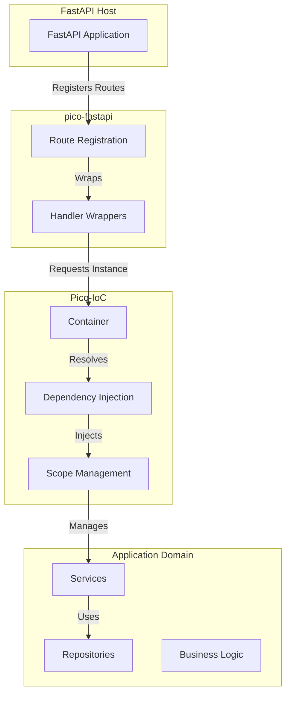
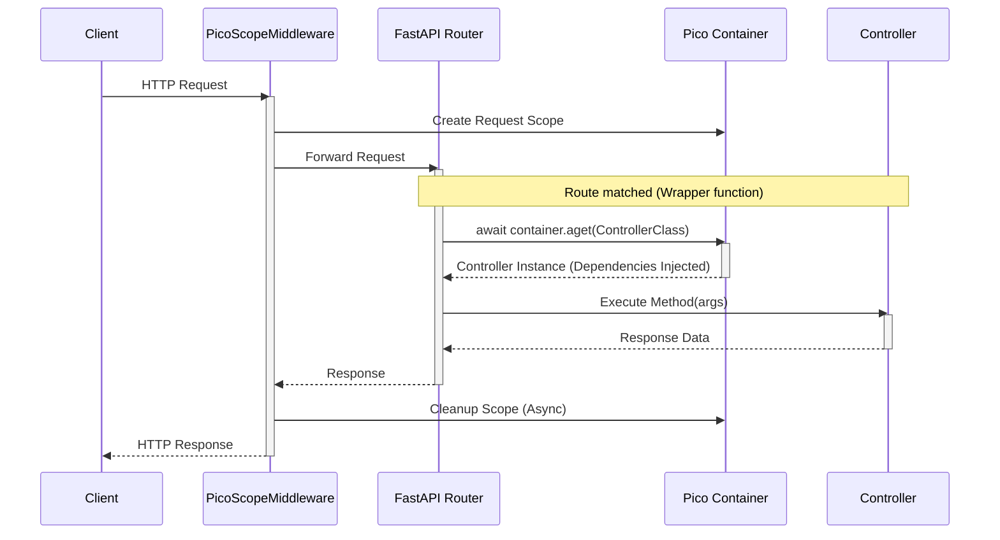
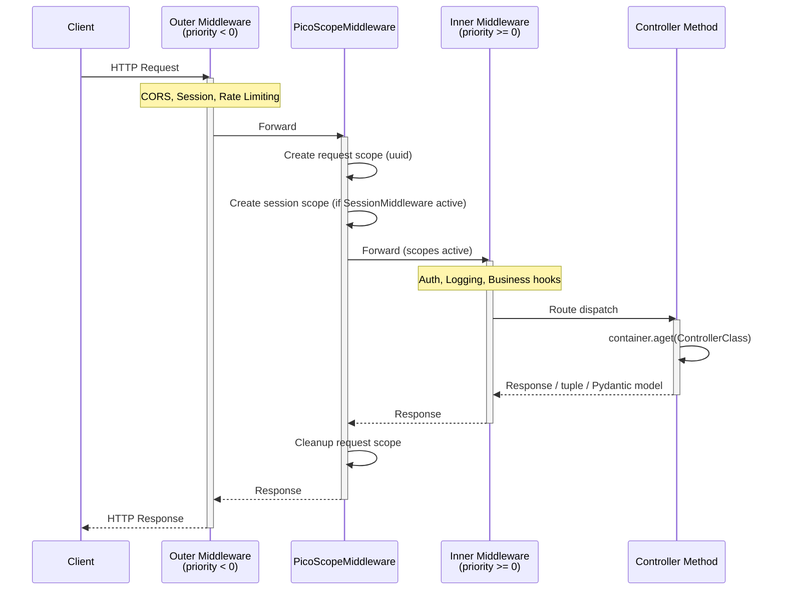
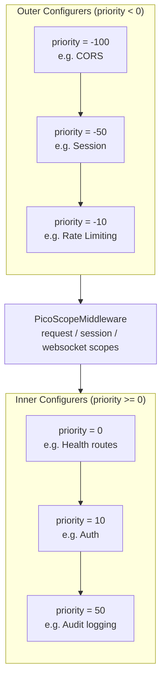
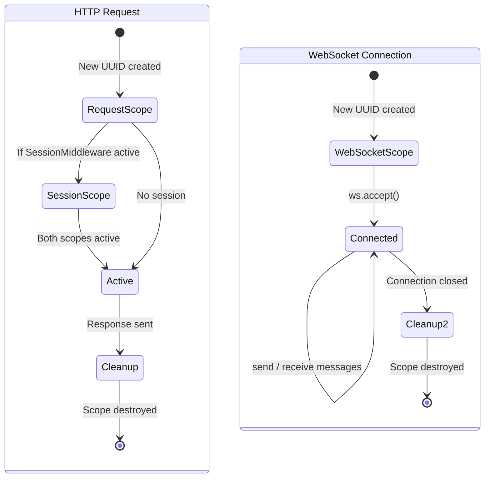

# 🧭 Architecture Overview — pico-fastapi

`pico-fastapi` is a thin integration layer that connects **Pico-IoC**'s inversion-of-control container with **FastAPI**'s routing and request handling.
Its purpose is not to replace FastAPI — but to ensure that **application logic is resolved through the container**, not through function-based dependency injection.

---

## 1. High-Level Design



-----

## 2\. Data Flow (HTTP Request)



### Key guarantees:

| Concern | Solution |
|--------|----------|
| No global singletons | Per-request scoped container |
| Constructor-based DI | All controllers resolved via IoC |
| Clean shutdown | Async cleanup via lifespan context |

-----

## 3\. Controller Model

  - Controllers are **regular Python classes**
  - They declare dependencies in `__init__`
  - They use decorators to express routing

<!-- end list -->

```python
@controller(prefix="/api")
class UserController:
    def __init__(self, service: UserService):
        self.service = service

    @get("/users")
    async def list(self):
        return self.service.list_users()
```

No dependency injection *inside endpoint signatures*.

-----

## 4\. Route Registration Strategy

At startup:

1.  **Inspection**: pico-fastapi queries the initialized **Pico-IoC container** (specifically its component locator) to find all registered components marked as controllers. It relies on the container as the single source of truth, avoiding global state.
2.  **Registration**: For each method decorated with `@get`, `@post`, etc., it registers a FastAPI route.
3.  **Wrapping**: Each route uses a dynamically generated wrapper:

<!-- end list -->

```python
async def route_handler(...):
    controller = await container.aget(ControllerClass)
    method = getattr(controller, method_name)
    return await method(...)
```

This ensures **all controller access goes through Pico-IoC**.

-----

## 5\. WebSocket Execution Model

WebSocket handlers:

  * Receive a live `WebSocket` instance
  * Are resolved via the request-scoped container just like HTTP routes
  * pico-fastapi provides a simple echo loop by default in examples, but it does not enforce patterns

Lifecycle:

```python
websocket.accept()
while active:
    message = websocket.receive_text()
    websocket.send_text(...)
```

Custom messaging layers (hubs, brokers, rooms) can be layered on top.

-----

## 6\. Scoping Model

| Scope | Use Case | Behavior |
| ----- | -------- | -------- |
| `singleton` | shared infra (DB pools, clients) | One instance per app |
| `request` *(default for controllers)* | HTTP/WebSocket request | New instance / cleanup per request |
| `session` or custom | multi-step workflows | Container-managed |

Scopes are enforced by **Pico-IoC**, not by FastAPI.

-----

## 7\. Cleanup & Lifespan

During FastAPI startup and shutdown, pico-fastapi:

  * Attaches a `lifespan` context
  * Ensures `await container.cleanup_all_async()` runs
  * Then calls `container.shutdown()`

This guarantees all components supporting `async __aenter__/__aexit__` or `cleanup()` are safely closed.

-----

## 8\. Request Lifecycle Through Middleware and Controller

The following diagram shows the full request path, including outer configurers (negative priority), PicoScopeMiddleware, and inner configurers (non-negative priority):



-----

## 9\. Configurer Priority Ordering

Configurers are split into two groups relative to `PicoScopeMiddleware`.  Within each group, lower priority numbers execute first:



Key rules:

- **Negative priority** = outer = applied **before** `PicoScopeMiddleware`
- **Non-negative priority** = inner = applied **after** `PicoScopeMiddleware`
- Outer middleware cannot access request-scoped services (scopes are not yet active)
- Inner middleware can access request-scoped services

-----

## 10\. Scope Lifecycle

Each scope type has a distinct lifecycle managed by `PicoScopeMiddleware`:



| Scope | Created | Destroyed | Typical Duration |
|-------|---------|-----------|------------------|
| `request` | On HTTP request arrival | After response is sent | Milliseconds |
| `session` | On first request with session cookie | When session expires or is cleared | Minutes to hours |
| `websocket` | On WebSocket CONNECT | On WebSocket DISCONNECT | Seconds to hours |
| `singleton` | On container initialization | On container shutdown | Application lifetime |

-----

## 11\. Architectural Intent

**pico-fastapi exists to:**

  * Decouple **business logic** from **web framework code**
  * Support **hexagonal / clean architecture**
  * Allow **test-friendly, replaceable dependencies**
  * Enable **complex service graphs** with clear ownership

It does *not* attempt to:

  * Replace FastAPI’s routing, docs, or validation system
  * Provide magic auto-scanning of modules
  * Hide the IoC container from developers

<!-- end list -->

