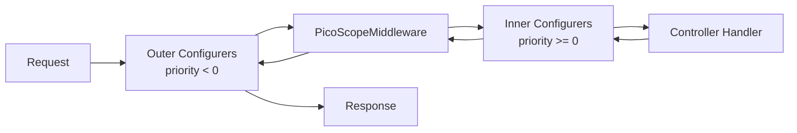

# Frequently Asked Questions

## General

### What's the difference between pico-fastapi and FastAPI's Depends()?

| Aspect | FastAPI `Depends()` | pico-fastapi |
|--------|---------------------|--------------|
| Injection style | Function parameters | Constructor |
| Scope management | Manual | Automatic |
| Testing | Override `Depends()` | Container overrides |
| Architecture | Framework-driven | Domain-driven |

**FastAPI Default:**
```python
from fastapi import Depends

def get_db():
    return Database()

@app.get("/users")
def get_users(db: Database = Depends(get_db)):
    return db.get_users()
```

**pico-fastapi:**
```python
from pico_fastapi import controller, get

@controller(prefix="/users")
class UserController:
    def __init__(self, db: Database):  # Injected automatically
        self.db = db

    @get("/")
    async def get_users(self):
        return self.db.get_users()
```

### Can I use FastAPI's Depends() with pico-fastapi?

Yes! They work together. Use `Depends()` for request-specific data (like getting current user from request), and pico-fastapi for service dependencies.

```python
from fastapi import Depends, Request
from pico_fastapi import controller, get

def get_current_user(request: Request):
    return request.state.user

@controller(prefix="/profile")
class ProfileController:
    def __init__(self, user_service: UserService):
        self.user_service = user_service

    @get("/")
    async def get_profile(self, user = Depends(get_current_user)):
        return self.user_service.get_profile(user.id)
```

### Do I need pico-boot to use pico-fastapi?

No, but it's recommended. Without pico-boot, you must explicitly include `pico_fastapi` modules:

```python
from pico_ioc import init  # Note: pico_ioc, not pico_boot

container = init(modules=[
    "myapp.controllers",
    "myapp.services",
    "pico_fastapi.config",      # Required
    "pico_fastapi.factory",     # Required
])
```

With pico-boot, pico-fastapi is auto-discovered.

---

## Controllers

### What's the default scope for controllers?

Controllers use `request` scope by default. Each HTTP request gets a fresh controller instance.

```python
@controller  # scope="request" by default
class MyController:
    pass
```

For WebSocket controllers, use `websocket` scope:

```python
@controller(scope="websocket")
class ChatController:
    pass
```

### Can I use the same controller for both HTTP and WebSocket?

No. Controllers are scoped to either HTTP or WebSocket, not both. This is intentional for lifecycle management.

```python
# HTTP Controller
@controller(prefix="/api")
class ApiController:
    @get("/status")
    async def status(self):
        return {"status": "ok"}

# WebSocket Controller (separate)
@controller(scope="websocket")
class WsController:
    @websocket("/ws")
    async def ws_endpoint(self, websocket):
        pass
```

### How do I add tags to my controller routes?

Use the `tags` parameter in the `@controller` decorator:

```python
@controller(prefix="/users", tags=["Users", "Admin"])
class UserController:
    pass
```

### Can I return tuples for status codes?

Yes! Return `(content, status_code)` or `(content, status_code, headers)`:

```python
@get("/item/{id}")
async def get_item(self, id: int):
    if id not in self.items:
        return {"error": "Not found"}, 404
    return self.items[id], 200
```

---

## Configurers

### What is a Configurer?

A Configurer is a class that implements `FastApiConfigurer` protocol and adds middleware or configures the FastAPI app.

```python
from pico_fastapi import FastApiConfigurer
from pico_ioc import component

@component
class MyConfigurer(FastApiConfigurer):
    priority = 0

    def configure(self, app: FastAPI) -> None:
        app.add_middleware(MyMiddleware)
```

### What does the priority number mean?

Priority determines when your middleware runs relative to `PicoScopeMiddleware`:

- **Negative priority (< 0)**: Outer middleware, runs BEFORE scopes are set up
- **Non-negative priority (>= 0)**: Inner middleware, runs AFTER scopes are set up

```
Request Flow:
[Outer: priority < 0] --> [PicoScopeMiddleware] --> [Inner: priority >= 0] --> Handler
```



### When should I use negative vs positive priority?

| Middleware Type | Priority | Reason |
|-----------------|----------|--------|
| CORS | -100 | Must handle preflight before anything |
| Session | -50 | Session data needed before scope setup |
| Auth (token parsing) | 10 | Can use request-scoped services |
| Logging | depends | Before auth = raw requests, after = with user info |

### Why isn't my configurer being applied?

Check these common issues:

1. **Missing `@component` decorator:**
   ```python
   @component  # Required!
   class MyConfigurer(FastApiConfigurer):
       pass
   ```

2. **Module not in init list:**
   ```python
   container = init(modules=[
       "myapp.configurers",  # Include your configurers module
   ])
   ```

3. **Not implementing the protocol:**
   ```python
   class MyConfigurer(FastApiConfigurer):
       # priority = 0  # Optional but recommended

       def configure(self, app: FastAPI) -> None:  # Required!
           pass
   ```

4. **Invalid configurer discarded silently:**
   Since v0.2.2, invalid configurers are logged as a warning and discarded
   rather than raising an error. Check your logs for:
   ```
   WARNING - Discarding invalid configurer <...>: does not implement FastApiConfigurer protocol
   ```

---

## Scopes

### What scopes are available?

| Scope | Description | Use Case |
|-------|-------------|----------|
| `singleton` | One instance for entire app | Stateless services |
| `request` | New instance per HTTP request | Request-specific state |
| `session` | Tied to HTTP session | Shopping cart, user preferences |
| `websocket` | One instance per WS connection | Chat connections |

### How does session scope work?

Session scope requires `SessionMiddleware` from Starlette:

```python
from starlette.middleware.sessions import SessionMiddleware
from pico_fastapi import FastApiConfigurer
from pico_ioc import component

@component
class SessionConfigurer(FastApiConfigurer):
    priority = -50  # Must be outer (before PicoScopeMiddleware)

    def configure(self, app: FastAPI) -> None:
        app.add_middleware(
            SessionMiddleware,
            secret_key="your-secret-key",
        )
```

Then use session-scoped components:

```python
@component(scope="session")
class ShoppingCart:
    def __init__(self):
        self.items = []
```

### How do I access the current scope ID?

You can inject `PicoContainer` and use its context methods:

```python
from pico_ioc import component, PicoContainer

@component(scope="request")
class RequestContext:
    def __init__(self, container: PicoContainer):
        # Access request ID from scope context
        self.request_id = container.get_scope_id("request")
```

---

## Testing

### How do I test controllers?

Use `TestClient` with container overrides:

```python
from fastapi.testclient import TestClient
from pico_boot import init

def test_controller():
    container = init(
        modules=["myapp"],
        overrides={RealService: MockService()},
    )
    app = container.get(FastAPI)

    with TestClient(app) as client:
        response = client.get("/api/endpoint")
        assert response.status_code == 200
```

### How do I mock a service?

Use container overrides:

```python
class MockUserService:
    def get_user(self, user_id: int):
        return {"id": user_id, "name": "Test User"}

container = init(
    modules=["myapp"],
    overrides={UserService: MockUserService()},
)
```

### How do I disable plugin auto-discovery in tests?

Set the environment variable:

```python
# conftest.py
import os

def pytest_configure(config):
    os.environ["PICO_BOOT_AUTO_PLUGINS"] = "false"
```

---

## Errors and Troubleshooting

### NoControllersFoundError

**Exact message:**
```
No controllers were registered. Ensure your controller modules are scanned.
```

**Type:** `pico_fastapi.exceptions.NoControllersFoundError` (subclass of `PicoFastAPIError`)

**Cause:** The `register_controllers()` function found no classes with the `@controller` decorator in the pico-ioc container.

**Fix:**

1. Ensure controllers have the `@controller` decorator:
   ```python
   from pico_fastapi import controller

   @controller(prefix="/api")  # This is required
   class MyController:
       pass
   ```

2. Include controller modules in `init()`:
   ```python
   container = init(modules=["myapp.controllers"])
   ```

3. Check for import errors in controller modules (a silent `ImportError` prevents registration).

---

### "Discarding invalid configurer" warning

**Exact log message:**
```
WARNING - Discarding invalid configurer <...>: does not implement FastApiConfigurer protocol
```

**Cause:** A component was provided as a configurer but does not satisfy the `FastApiConfigurer` runtime-checkable protocol (missing `configure()` method or not an instance of the protocol).

**Fix:**

1. Ensure your configurer class implements the protocol:
   ```python
   from pico_fastapi import FastApiConfigurer

   @component
   class MyConfigurer(FastApiConfigurer):
       priority = 0

       def configure(self, app: FastAPI) -> None:  # Must exist
           pass
   ```

2. Check that `configure` is a callable method, not a property or attribute.

---

### "Component not found" for controller dependency

**Cause:** A dependency declared in a controller's `__init__` is not registered in the container.

**Fix:**

1. Add `@component` to the dependency class:
   ```python
   @component
   class UserService:
       pass
   ```

2. Include the dependency's module in `init()`.

3. Check for typos in type hints -- the type hint must exactly match the registered class.

---

### "No WebSocket-annotated parameter found" debug log

**Exact log message:**
```
DEBUG - No WebSocket-annotated parameter found in <Class>.<method>, defaulting to 'websocket'
```

**Cause:** A WebSocket handler method has no parameter with a `WebSocket` type annotation.

**Fix:** Add the annotation explicitly:
```python
from fastapi import WebSocket

@websocket("/ws")
async def handle(self, ws: WebSocket):  # Add `: WebSocket`
    await ws.accept()
```

---

## Advanced

### Can I have multiple FastAPI apps?

Yes, each `init()` creates a separate container and app:

```python
admin_container = init(modules=["admin"])
admin_app = admin_container.get(FastAPI)

public_container = init(modules=["public"])
public_app = public_container.get(FastAPI)
```

### How do I customize FastAPI settings?

Create a config file with `fastapi` prefix:

```yaml
# application.yaml
fastapi:
  title: My API
  version: 2.0.0
  debug: false
```

Settings are automatically applied via `FastApiSettings`.

### Can I use pico-fastapi with other frameworks?

Pico-fastapi is specific to FastAPI. For other frameworks, see:

- `pico-celery` for Celery
- `pico-sqlalchemy` for SQLAlchemy

### How do I add static files?

Use a configurer:

```python
from fastapi.staticfiles import StaticFiles
from pico_fastapi import FastApiConfigurer
from pico_ioc import component

@component
class StaticConfigurer(FastApiConfigurer):
    priority = -100

    def configure(self, app: FastAPI) -> None:
        app.mount("/static", StaticFiles(directory="static"), name="static")
```

### Is pico-fastapi thread-safe?

Yes, as thread-safe as FastAPI and pico-ioc. Request scopes are isolated per request. However, singleton components shared across requests must be designed for thread safety.
