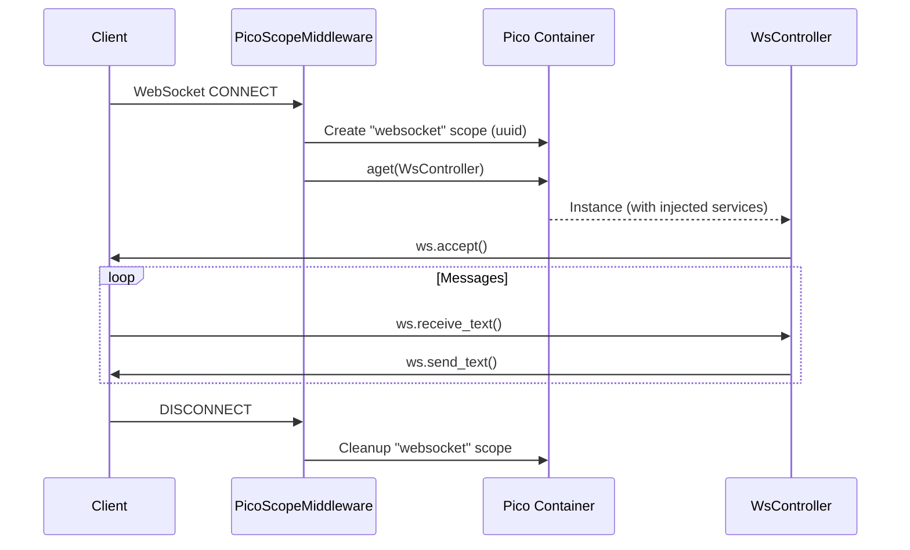

# How to Create WebSocket Controllers

This guide explains how to build WebSocket endpoints using pico-fastapi controllers, including scope management, parameter detection, and testing.

---

## Key Concepts

- WebSocket controllers should use `scope="websocket"` so the controller instance lives for the entire connection.
- The WebSocket parameter is detected by **type annotation** (`ws: WebSocket`), not by argument name.
- `PicoScopeMiddleware` automatically creates and cleans up a `websocket` scope for each connection.

---

## Step 1: Define a WebSocket Controller

```python
# controllers.py
from fastapi import WebSocket
from pico_fastapi import controller, websocket


@controller(scope="websocket")
class EchoController:
    @websocket("/ws/echo")
    async def echo(self, ws: WebSocket):
        await ws.accept()
        try:
            while True:
                data = await ws.receive_text()
                await ws.send_text(f"Echo: {data}")
        except Exception:
            pass
```

The parameter name does not matter -- `ws`, `websocket`, `conn` -- pico-fastapi finds it by the `WebSocket` type annotation.

---

## Step 2: Inject Services

Controllers support constructor injection just like HTTP controllers:

```python
from pico_ioc import component
from fastapi import WebSocket
from pico_fastapi import controller, websocket


@component
class ChatService:
    async def broadcast(self, message: str):
        # Broadcast to connected clients
        pass


@controller(scope="websocket")
class ChatController:
    def __init__(self, chat: ChatService):
        self.chat = chat

    @websocket("/ws/chat")
    async def chat_endpoint(self, ws: WebSocket):
        await ws.accept()
        try:
            while True:
                message = await ws.receive_text()
                await self.chat.broadcast(message)
                await ws.send_text(f"Sent: {message}")
        except Exception:
            pass
```

---

## Scope Lifecycle

The `websocket` scope is created when the WebSocket connection is established and destroyed when the connection closes:



---

## Testing WebSocket Endpoints

Use Starlette's `TestClient` with `websocket_connect`:

```python
from fastapi import FastAPI
from fastapi.testclient import TestClient


def test_echo_websocket(app: FastAPI):
    with TestClient(app) as client:
        with client.websocket_connect("/ws/echo") as ws:
            ws.send_text("hello")
            data = ws.receive_text()
            assert data == "Echo: hello"
```

---

## Common Mistakes

### Using `scope="request"` for WebSocket controllers

If you forget to set `scope="websocket"`, the controller instance is tied to a `request` scope, which may be cleaned up prematurely:

```python
# Wrong -- controller may be garbage collected mid-connection
@controller
class BadWsController:
    @websocket("/ws")
    async def handle(self, ws: WebSocket):
        ...

# Correct
@controller(scope="websocket")
class GoodWsController:
    @websocket("/ws")
    async def handle(self, ws: WebSocket):
        ...
```

### Missing type annotation on WebSocket parameter

If no parameter has a `WebSocket` type annotation, pico-fastapi defaults to injecting the WebSocket as `websocket`. Add the annotation explicitly to avoid confusion:

```python
# Ambiguous -- relies on default fallback
@websocket("/ws")
async def handle(self, conn):
    ...

# Explicit -- recommended
@websocket("/ws")
async def handle(self, conn: WebSocket):
    ...
```
